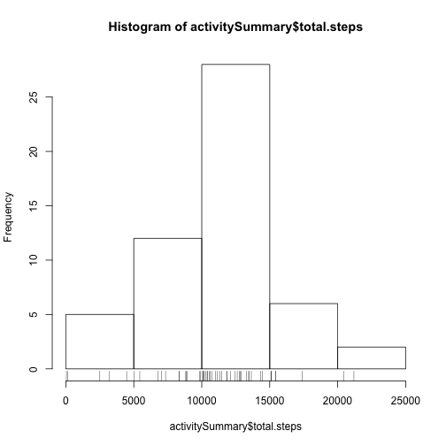
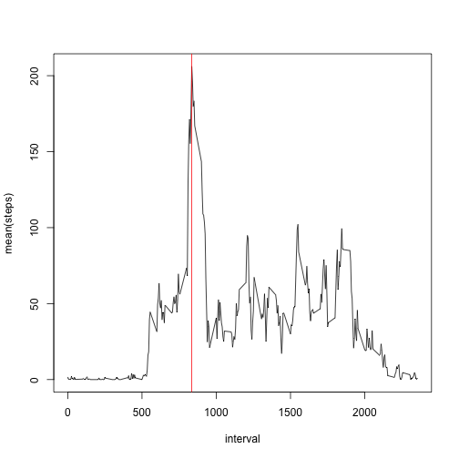
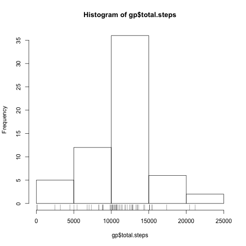
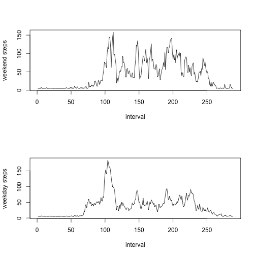

## Loading and preprocessing the data


```r
library(lubridate)
library(dplyr)
setwd("~/RepData_PeerAssessment1")
unzip("activity.zip")
list.files()
```

```
## [1] "activity.csv"       "activity.zip"       "doc"               
## [4] "instructions_fig"   "PA1_template_files" "PA1_template.html" 
## [7] "PA1_template.md"    "PA1_template.Rmd"   "README.md"
```

```r
activity = read.csv("activity.csv")
names(activity)
```

```
## [1] "steps"    "date"     "interval"
```

```r
activity$date = ymd(activity$date)
activity = tbl_df(activity)
```
## What is mean total number of steps taken per day?


```r
# Summarize the data
activitySummary = summarize(group_by(na.omit(activity), date), total.steps = sum(steps), mean.steps = mean(steps), median.steps = median(steps))
```

Below is a histogram of the total steps taken per day.


```r
hist(activitySummary$total.steps)
rug(activitySummary$total.steps)
```

 

Report the mean and median of the total number of steps taken per day


```r
# Mean of total number of steps taken per day
mean(activitySummary$total.steps)
```

```
## [1] 10766.19
```

```r
# Median of total number of steps taken per day
median(activitySummary$total.steps)
```

```
## [1] 10765
```
## What is the average daily activity pattern?


```r
# Omit NA's and summarize the data according to intervals.
activitySummary2 = summarize(group_by(na.omit(activity), interval), mean(steps))
plot(activitySummary2, type = "l")

# Which 5-minute interval, on average across all the days in the dataset, contains the maximum number of steps?

max.interval = activitySummary2$interval[which.max(activitySummary2$`mean(steps)`)]
print(max.interval)
```

```
## [1] 835
```

```r
# Verify the finding on chart

abline(v = max.interval, col = "red")
```

 

## Imputing missing values

Calculate and report the total number of missing values in the dataset (i.e. the total number of rows with NAs)


```r
sum(is.na(activity))
```

```
## [1] 2304
```

Devise a strategy for filling in all of the missing values in the dataset. The strategy does not need to be sophisticated. For example, you could use the mean/median for that day, or the mean for that 5-minute interval, etc.

Create a new dataset called activity.filled that is equal to the original dataset but with the missing data filled in.


```r
# Define function to replace missing value with mean of series

impute.mean <- function(x) replace(x, is.na(x), mean(x, na.rm = TRUE))

# create new data frame

activity.filled = data.frame(impute.mean(activity$steps), activity$date, impute.mean(activity$interval))
colnames(activity.filled) <- c("steps", "date", "interval")


# test if impute worked

sum(is.na(activity.filled))
```

```
## [1] 0
```

Histogram of the total number of steps taken each day and Calculate and report the mean and median total number of steps taken per day.


```r
gp = summarize(group_by(activity.filled, date), total.steps = sum(steps))

hist(gp$total.steps)
rug(gp$total.steps)
```

 

Report the mean and median of the total number of steps taken per day


```r
# Mean of total number of steps taken per day
mean(gp$total.steps)
```

```
## [1] 10766.19
```

```r
# Median of total number of steps taken per day
median(gp$total.steps)
```

```
## [1] 10766.19
```

The impact of imputing missing values:

* The mean of total number of steps per day stays the same.

* The median of total number of steps per day changes and is no longer an integer. The reason is that we used the average number of steps per interval, which are not always intergers, to replace missing values.

* Replacing missing values generally increases the total daily number of steps. The histogram has higher bars than the old version.

## Are there differences in activity patterns between weekdays and weekends?


```r
af = tbl_df(activity.filled)
af = mutate(af, DaysOfWeek = weekdays(af$date))
af.weekend = filter(af, af$DaysOfWeek == "Sunday" | af$DaysOfWeek == "Saturday")
af.weekday = filter(af, af$DaysOfWeek != "Sunday" | af$DaysOfWeek != "Saturday")
af.weekend.sum = summarize(group_by(af.weekend, interval), avg.steps = mean(steps))
af.weekday.sum = summarize(group_by(af.weekday, interval), avg.steps = mean(steps))


# Plot
plot.new()
par(mfrow = c(2,1))
plot(af.weekend.sum$avg.steps, type = "l", xlab = "interval", ylab = "weekend steps")
plot(af.weekday.sum$avg.steps, type = "l", xlab = "interval", ylab = "weekday steps")
```

 
